# FUEGO CRUZADO

## 👥 Miembros del Equipo
| Nombre y Apellidos | Correo URJC | Usuario GitHub |
|:--- |:--- |:--- |
| AARÓN ALAMEDA ALCAIDE | a.alameda.2023@alumnos.urjc.es | Aaron-Alameda |
| ELENA ARCAZ CEJAS | e.arcaz.2022@alumnos.urjc.es | eLNiTa |
| JORGE ANTONIO ARJONA RICO | ja.arjonar.2022@alumnos.urjc.es | J0rg3Arjona |
| ALEJANDRO TERRAZAS VARGAS | a.terrazas.2022@alumnos.urjc.es | alexone522 |

---

## 🎭 **Preparación: Definición del Proyecto**

### **Descripción del Tema**
Online shop selling airsoft guns.

### **Entidades**
Indicar las entidades principales que gestionará la aplicación y las relaciones entre ellas:

1. **User**
2. **Product**
3. **Order**
4. **Review**

**Relaciones entre entidades:**
- User - Order: A user can have multiple orders (1:N) and an order belongs to one user.
- User - Review: A user can have multiple reviews (1:N).
- Review - Product: A review belongs to one product (1:N) and a product can have many reviews.
- Order - Product: An order contains several products and a product can be in several orders (N:M).

### **Permisos de los Usuarios**
Describir los permisos de cada tipo de usuario e indicar de qué entidades es dueño:

* **Usuario Anónimo**: 
  - Permissions: Catalog viewing, product search, registration
  - Owns no entities

* **Usuario Registrado**: 
  - Permissions: Profile management, placing orders, creating Reviews
  - Owns: Their own Orders, their User Profile, their Reviews

* **Administrador**: 
  - Permissions: Full product management (CRUD), content moderation
  - Owns: Products, Categories, can manage all Orders and Users

### **Imágenes**
Indicar qué entidades tendrán asociadas una o varias imágenes:

- **[Entidad con imágenes 1]**: User - One avatar image per user
- **[Entidad con imágenes 2]**: Product - One image per product

---

## 🛠 **Práctica 1: Maquetación de páginas con HTML y CSS**

### **Vídeo de Demostración**
📹 **[Enlace al vídeo en YouTube](https://www.youtube.com/watch?v=x91MPoITQ3I)**
> Vídeo mostrando las principales funcionalidades de la aplicación web.

### **Diagrama de Navegación**
Diagrama que muestra cómo se navega entre las diferentes páginas de la aplicación:


**1-Public Flow (Non-Registered Users):**
Users can freely browse the homepage and the shop.
From any page, they can access register or login.

**2-Registered User Flow:**
After logging in, the user accesses their personal profile.
From their profile, they can view their purchase history and modify their data.
They can add products to the cart from shop pages and proceed to checkout.

**3-Administrator Flow:**
Administrators have access to an exclusive control panel.
From there they can manage users and manage products.
They also have access to the orders list for management.

### **Capturas de Pantalla y Descripción de Páginas**

#### **1. Main Page / Home**

Homepage displaying featured promotional banner, main product categories, and introductory content. Includes persistent navigation header with access to Shop and Account sections. Provides first impressions of the brand's tactical gear focus.
#### **2. Login Page**
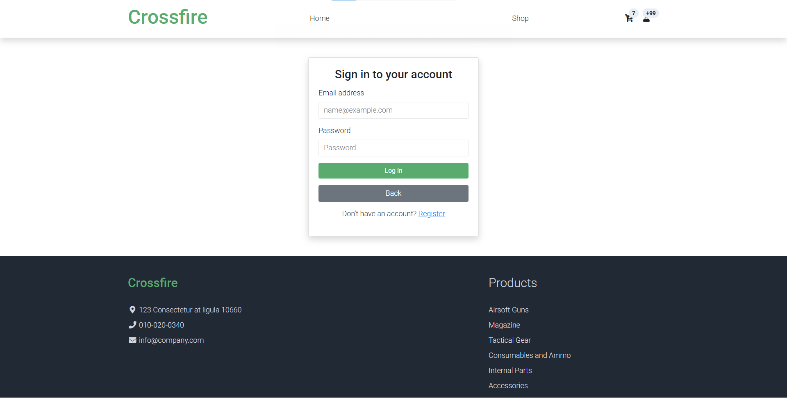
User authentication page with email and password fields. Includes "Login" and "Back" buttons, plus a registration link for new users. Maintains site navigation and footer with contact information and product categories.
#### **3. User Form Page / Register**
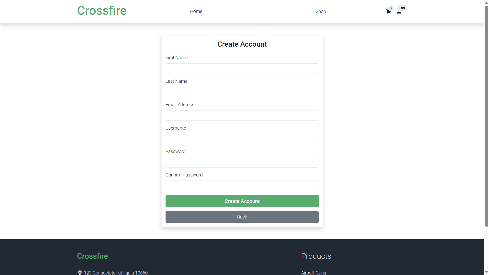
New user registration form collecting personal details: first name, last name, email address, username, password with confirmation. Features "Create Account" and "Back" navigation buttons.
#### **4. Shop Page**
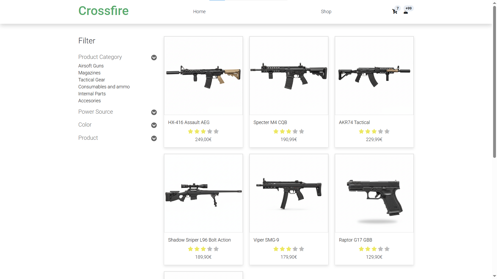
Main product catalog with advanced filtering options (category, power source, color, product type). Displays six featured airsoft products with images and prices in a grid layout for easy browsing.
#### **5.Shop Details Pages from 1 to 3**
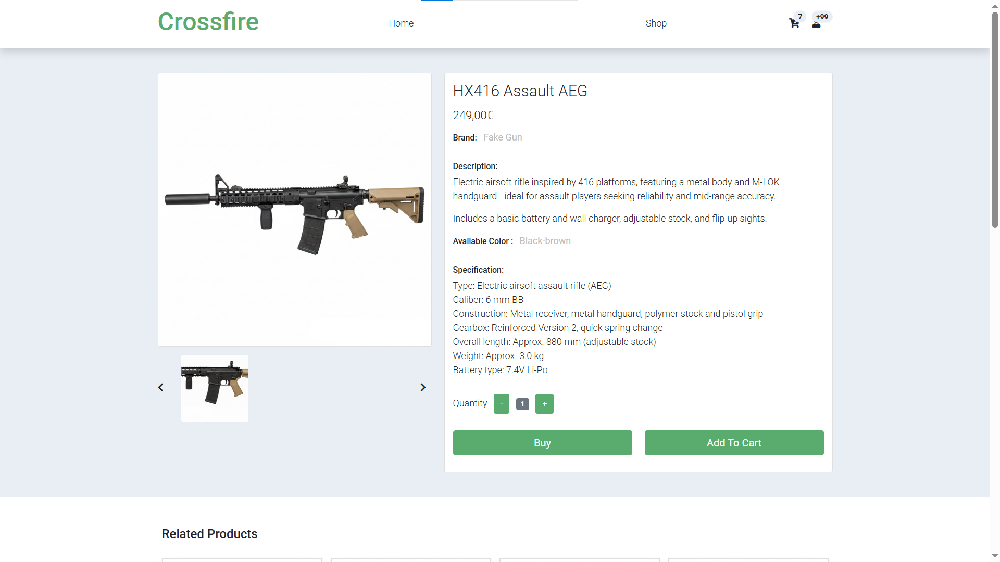
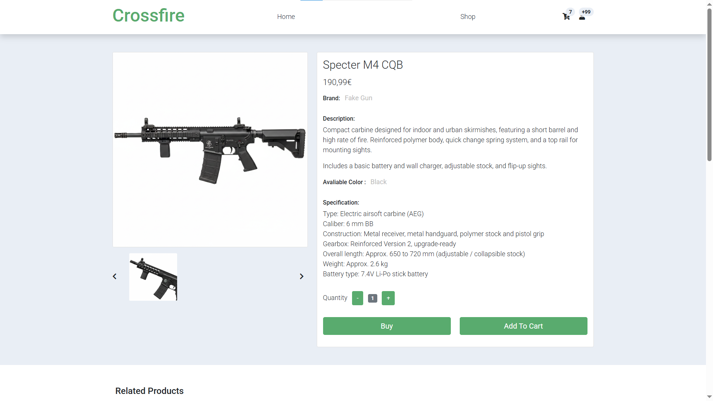
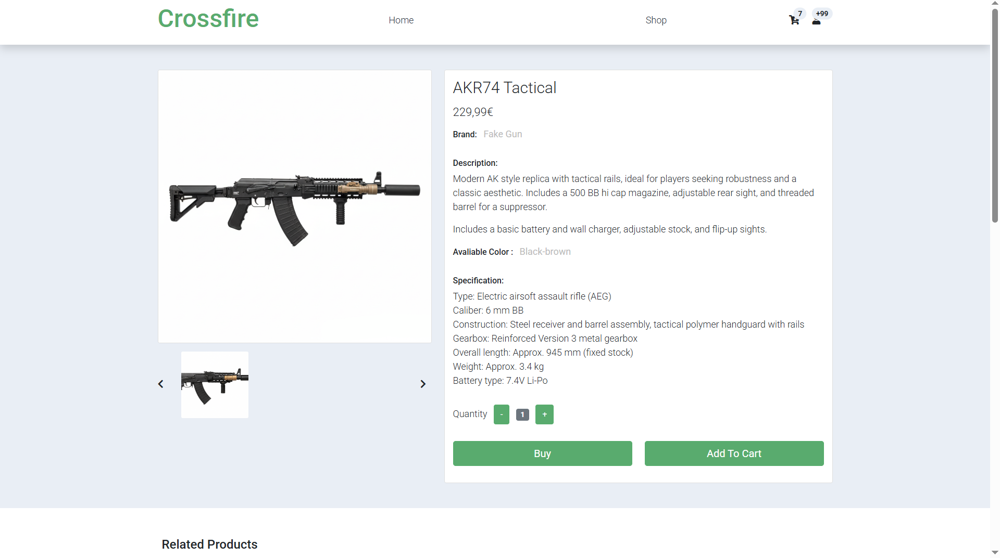
Detailed product pages for individual items (HX416 Assault AEG, Specter M4 CQB, AKR74 Tactical). Each includes product specifications, descriptions, available colors, pricing, quantity selector, and action buttons (Buy/Add to Cart). Shows related products section.
#### **6. Shopping Cart Page**
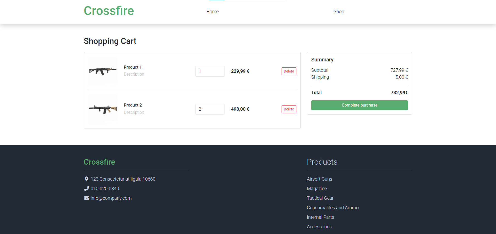
Shopping cart interface displaying selected items with descriptions, prices, and delete options. Shows order summary including subtotal, shipping costs, and total amount. Features "Complete purchase" button for checkout.
#### **7. Profile 1 & Profile 2 Pages**
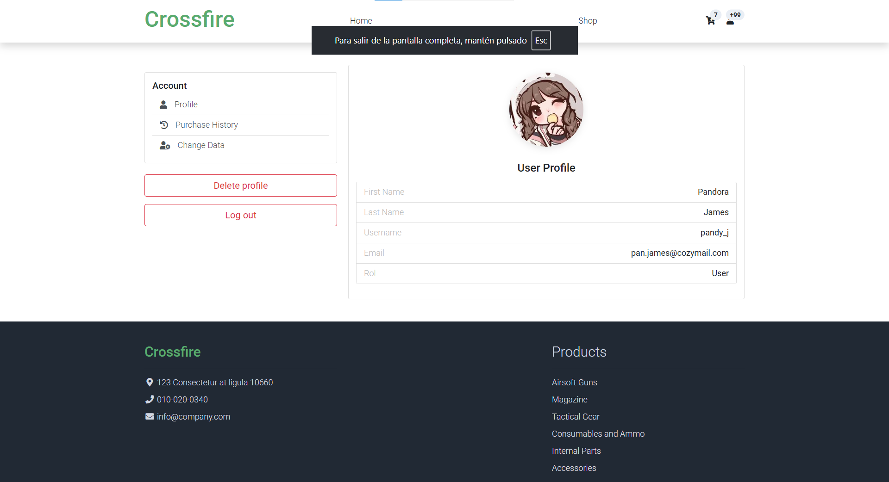
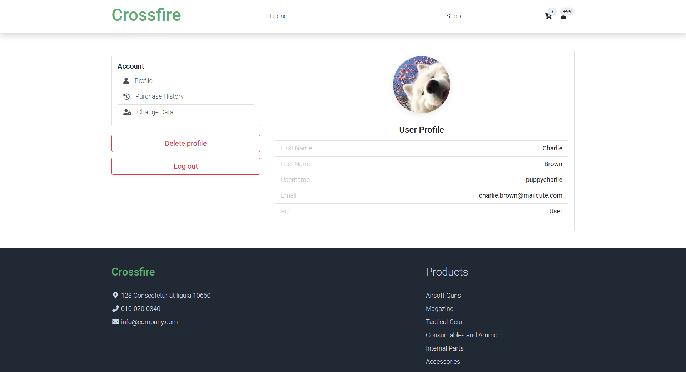
User profile pages displaying personal information (Pandora James and Charlie Brown respectively). Shows user details: name, username, email, role (User). Includes account management options and delete profile functionality.
#### **8. Orders Page**
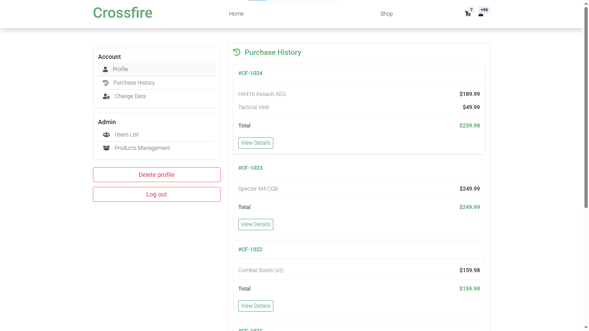
Purchase history page showing past orders with order numbers (#CF-1024, #CF-1023, #CF-1022). Each entry displays purchased items, totals, and "View Details" buttons. Accessible from user account menu.
#### **9. Admin Page**
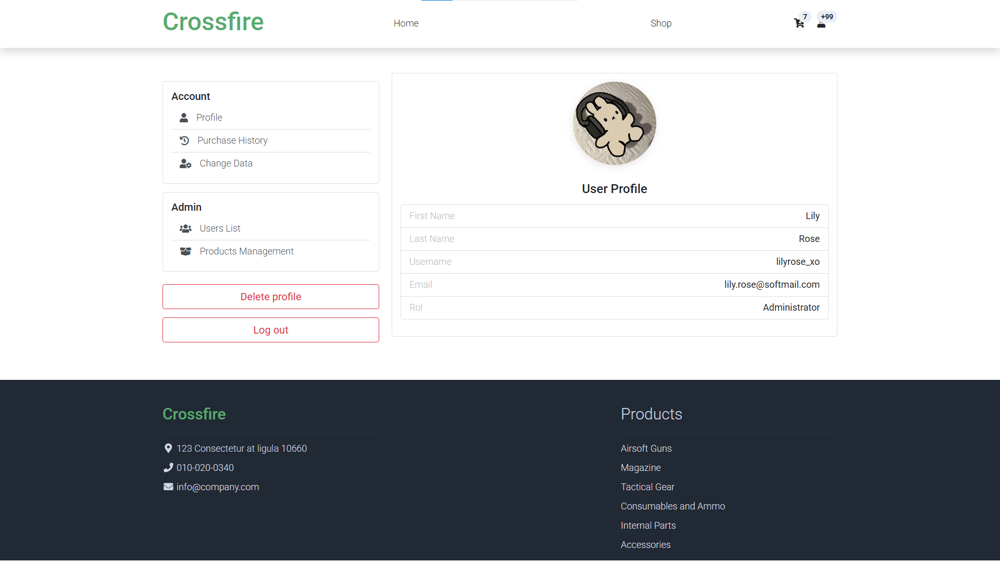
Administrator dashboard showing Lily Rose's admin profile with elevated privileges. Displays admin-specific navigation options including Users List and Products Management alongside standard user features.
#### **10. Admin User Panel Page**
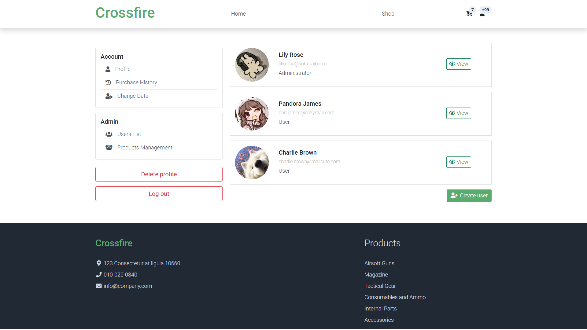
Clean interface showing the administrator's view with user list (Lily Rose - Admin, Pandora James - User, Charlie Brown - User). Highlights the admin's expanded navigation options for user and product management.
#### **11. Admin Product Panel Page**
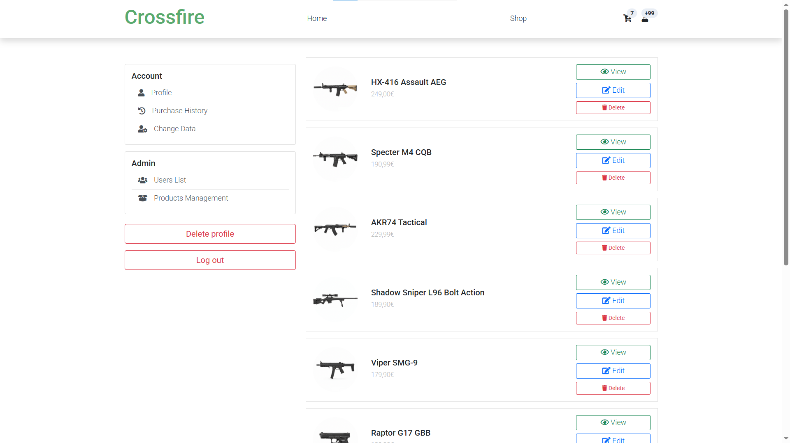
Admin product management page displaying the full product catalog with edit/delete controls for each item. Shows six products with prices and management options, accessible only to administrators.
#### **12. Product Details Pages from 1 to 3**
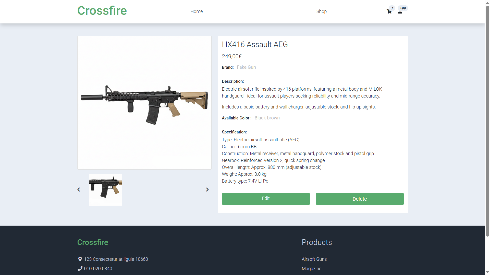
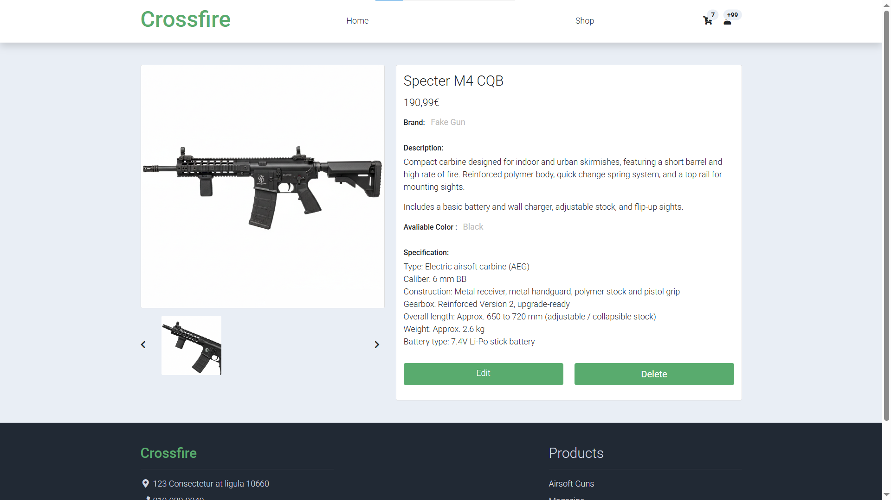
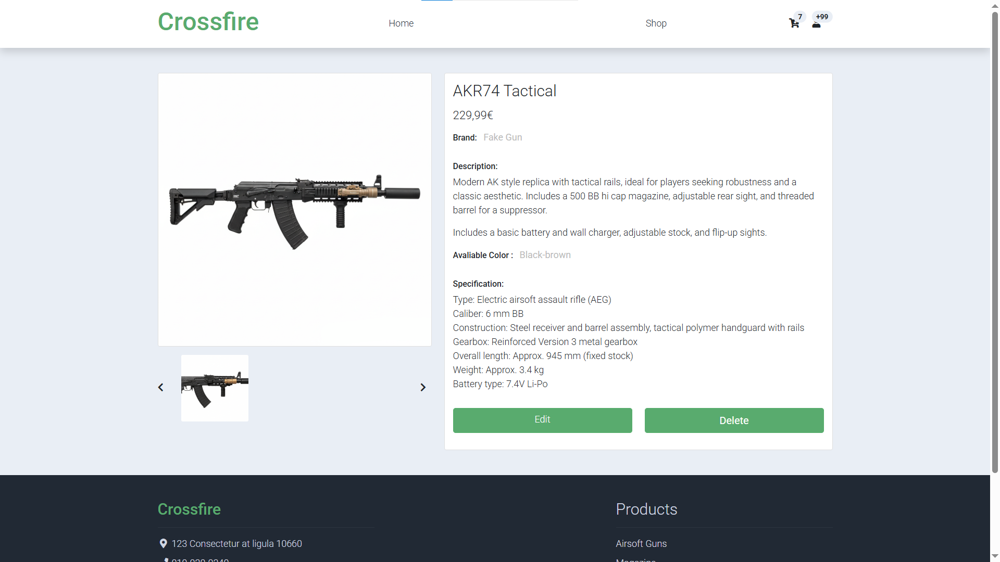
Administrator view of product detail pages showing additional Edit/Delete buttons not available to regular users. Allows direct product management from the detailed view.
#### **13. Product Form Page**
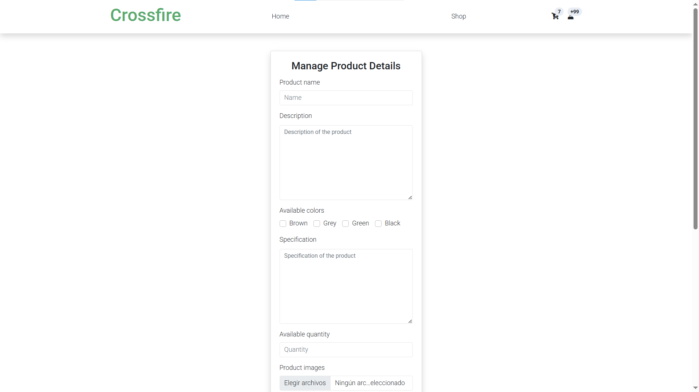
Product creation/editing form for administrators with fields for product name, description, available colors, specifications, quantity, and image upload. Used for adding new products or modifying existing ones.

### **Participación de Miembros en la Práctica 1**

#### **Alumno 1 - [Alejandro Terrazas Vargas]**

[Retocar la UI de la pagina de perfil del usuario y del administrador y modificacion del index.html]

| Nº    | Commits      | Files      |
|:------------: |:------------:| :------------:|
|1| [Add new images and update product descriptions for enhanced visual appeal and clarity](https://github.com/DWS-2026/project-grupo-6/commit/d37cc7f64a2646452556b58c01dd3254c3ed893b)  | [Index.html](https://github.com/DWS-2026/project-grupo-6/blob/d37cc7f64a2646452556b58c01dd3254c3ed893b/templates/index.html)   |
|2| [Add login form ID and implement client-side redirection logic](https://github.com/DWS-2026/project-grupo-6/commit/19c4c3ac2700eb92d270cb5b7ee2ef652ac67dd3)  | [login.html](https://github.com/DWS-2026/project-grupo-6/blob/19c4c3ac2700eb92d270cb5b7ee2ef652ac67dd3/templates/login.html)   |
|3| [Enhance admin templates: update navigation links, add user account section, and improve layout for better usability](https://github.com/DWS-2026/project-grupo-6/commit/1bb24d3b9a4afee75625f79d58f9c0298720cc3a)  | [admin-product-page.html](https://github.com/DWS-2026/project-grupo-6/blob/1bb24d3b9a4afee75625f79d58f9c0298720cc3a/templates/admin-product-page.html) [admin.html](https://github.com/DWS-2026/project-grupo-6/blob/1bb24d3b9a4afee75625f79d58f9c0298720cc3a/templates/admin.html) [admin-user-page.html](https://github.com/DWS-2026/project-grupo-6/blob/1bb24d3b9a4afee75625f79d58f9c0298720cc3a/templates/admin-user-page.html)   |
|4| [Update profile and orders links in admin and profile templates; add purchase history page with styling](https://github.com/DWS-2026/project-grupo-6/commit/6e725d8a82da8699606938b7e751e65f0ba60390)  | [orders.html](https://github.com/DWS-2026/project-grupo-6/blob/6e725d8a82da8699606938b7e751e65f0ba60390/templates/orders.html)   |
|5| [Add customer reviews and comments section to product detail pages](https://github.com/DWS-2026/project-grupo-6/commit/b84f278ffe288eee41a627f8f15e04e382b997dd)  | [shop-single.html](https://github.com/DWS-2026/project-grupo-6/blob/b84f278ffe288eee41a627f8f15e04e382b997dd/templates/shop-single.html) [shop-single2.html](https://github.com/DWS-2026/project-grupo-6/blob/b84f278ffe288eee41a627f8f15e04e382b997dd/templates/shop-single2.html) [shop-single3.html](https://github.com/DWS-2026/project-grupo-6/blob/b84f278ffe288eee41a627f8f15e04e382b997dd/templates/shop-single3.html)   |

---

#### **Alumno 2 - [Aarón Alameda Alcaide]**

[Developed the front-end structure and documentation for a website, including key pages, forms, diagrams, and layout adjustments.]

| Nº    | Commits      | Files      |
|:------------: |:------------:| :------------:|
|1| [Add shopping cart page](https://github.com/DWS-2026/dws-2026-project-base/commit/39502fb0e960c07d2762f1c36b0dab3bffd9e216)  | [Shopping-cart.html](https://github.com/DWS-2026/project-grupo-6/blob/main/templates/shopping-cart.html)   |
|2| [Added User Creation Form](https://github.com/DWS-2026/dws-2026-project-base/commit/85ab65b221308e5aebcf21904e543123ae3f7325)  | [User-form.html](https://github.com/DWS-2026/project-grupo-6/blob/main/templates/user-form.html)   |
|3| [Added Navigation Diagram](https://github.com/DWS-2026/dws-2026-project-base/commit/ca8cbf9b5c18a4dd7410c0c085cc07b9a12759cd)  | [DiagramaNavegacionCrossfire.png](https://github.com/DWS-2026/project-grupo-6/blob/main/images/DiagramaNavegacionCrossfire.png)   |
|4| [Enhance README with page descriptions and images](https://github.com/DWS-2026/dws-2026-project-base/commit/2d226d94e99ae2b50e1f810d6a35170a1f2f7b1a)  | [README.md](https://github.com/DWS-2026/project-grupo-6/blob/main/README.md)   |
|5| [Adjust index footer layout](https://github.com/DWS-2026/dws-2026-project-base/commit/c8b01e6e9bdbd1126ad5839e4cbcbc17d7856e56)  | [Index.html](https://github.com/DWS-2026/project-grupo-6/blob/main/templates/index.html)   |

---

#### **Alumno 3 - [Jorge Antonio Arjona Rico]**

[ Worked on documenting the project and developing the shop section of the website, adding product images, prices, and descriptions, and ensuring correct visual presentation and consistency across pages.]

| Nº    |               Commits                |                                                           Files                                                           |
|:------------: |:------------------------------------:|:-------------------------------------------------------------------------------------------------------------------------:|
|1|           [Update README.md](https://github.com/DWS-2026/dws-2026-project-base/commit/359ed00260e4d51dff03c4ccd03d9e26ec46732f)           |                       [README.md](https://github.com/DWS-2026/project-grupo-6/blob/main/README.md)                        |
|2| [Added the images and prices and prices of the assault riffles in shop.html](https://github.com/DWS-2026/dws-2026-project-base/commit/5ad1777b55069d614c1328e749c44fba332226c0) | [shop.html and images in assets folder](https://github.com/DWS-2026/project-grupo-6/blob/main/templates/shop-single.html) |
|3| [Added images and description to shop-single.html](https://github.com/DWS-2026/dws-2026-project-base/commit/8f94eb169f99be8a2ba990b99be45e6f50c44c6b) | [shop.html and images in assets folder](https://github.com/DWS-2026/project-grupo-6/blob/main/templates/shop-single.html) |
|4| [Added the rest of the guns and correct image dimensions](https://github.com/DWS-2026/dws-2026-project-base/commit/2b6fdc901a401c75556ec3383d8449fe51e7c8db) | [shop.html and images in assets folder](https://github.com/DWS-2026/project-grupo-6/blob/main/templates/shop-single.html) |
|5| [Added a temporary shop-single3 and photos to shop-single2](https://github.com/DWS-2026/dws-2026-project-base/commit/7969b538e4c682ee9b817e757439d9ec772ccf3d) |                                 [shop-single2.html and shop-single3.html](https://github.com/DWS-2026/project-grupo-6/blob/main/templates/shop-single3.html)                                  |

---

#### **Alumno 4 - [Elena Arcaz Cejas]**

[Development and enhancement of the administrative interface of the project. Included integrating a Bootstrap template, creating product forms, completing the product carousel, fixing bugs and logic of redirection.]

| Nº    | Commits      |                                                                     Files                                                                     |
|:------------: |:------------:|:---------------------------------------------------------------------------------------------------------------------------------------------:|
|1| [Adding Bootstrap template](https://github.com/DWS-2026/dws-2026-project-base/commit/73712cc38d963f6de131ee60caf37d5c337c554d)  |                              [templates folder](https://github.com/DWS-2026/project-grupo-6/tree/main/templates)                              |
|2| [Adding initial product form structure](https://github.com/DWS-2026/dws-2026-project-base/commit/de9a41c0eaa1d309b78e7f32edb29e5863d2c953)  |                    [product-form.html](https://github.com/DWS-2026/project-grupo-6/blob/main/templates/product-form.html)                     |
|3| [Completing admin product carousel, fixing redirect logic and clean up unused assets](https://github.com/DWS-2026/dws-2026-project-base/commit/2c3eca56369c58b5c9b679c3e6419ce6ce319627)  |              [admin-product-page.html](https://github.com/DWS-2026/project-grupo-6/blob/main/templates/admin-product-page.html)               |
|4| [Adding admin product templates, fixing redirection logic and minor bugs](https://github.com/DWS-2026/dws-2026-project-base/commit/40a9461b17160e595c68227ce727ebd225d65ee1)  | [admin-product-page.html, product(1,2,3)-details.html](https://github.com/DWS-2026/project-grupo-6/blob/main/templates/product1-details.html) |
|5| [Correcting user detail templates in admin panel](https://github.com/DWS-2026/dws-2026-project-base/commit/23676487f77c3e7f7e3667cbb23e63e0bc664448)  |                                           [admin-user-page.html, profile(2,3).html](https://github.com/DWS-2026/project-grupo-6/blob/main/templates/profile2.html)                                            |

---

## 🛠 **Práctica 2: Web con HTML generado en servidor**

### **Vídeo de Demostración**
📹 **[Enlace al vídeo en YouTube](https://www.youtube.com/watch?v=x91MPoITQ3I)**
> Vídeo mostrando las principales funcionalidades de la aplicación web.

### **Navegación y Capturas de Pantalla**

#### **Diagrama de Navegación**

Solo si ha cambiado.

#### **Capturas de Pantalla Actualizadas**

Solo si han cambiado.

### **Instrucciones de Ejecución**

#### **Requisitos Previos**
- **Java**: versión 21 o superior
- **Maven**: versión 3.8 o superior
- **MySQL**: versión 8.0 o superior
- **Git**: para clonar el repositorio

#### **Pasos para ejecutar la aplicación**

1. **Clonar el repositorio**
   ```bash
   git clone https://github.com/[usuario]/[nombre-repositorio].git
   cd [nombre-repositorio]
   ```

2. **AQUÍ INDICAR LO SIGUIENTES PASOS**

#### **Credenciales de prueba**
- **Usuario Admin**: usuario: `admin`, contraseña: `admin`
- **Usuario Registrado**: usuario: `user`, contraseña: `user`

### **Diagrama de Entidades de Base de Datos**

Diagrama mostrando las entidades, sus campos y relaciones:


> [Descripción opcional: Ej: "El diagrama muestra las 4 entidades principales: Usuario, Producto, Pedido y Categoría, con sus respectivos atributos y relaciones 1:N y N:M."]

### **Diagrama de Clases y Templates**

Diagrama de clases de la aplicación con diferenciación por colores o secciones:


> [Descripción opcional del diagrama y relaciones principales]

### **Participación de Miembros en la Práctica 2**

#### **Alumno 1 - [Nombre Completo]**

[Descripción de las tareas y responsabilidades principales del alumno en el proyecto]

| Nº    | Commits      | Files      |
|:------------: |:------------:| :------------:|
|1| [Descripción commit 1](URL_commit_1)  | [Archivo1](URL_archivo_1)   |
|2| [Descripción commit 2](URL_commit_2)  | [Archivo2](URL_archivo_2)   |
|3| [Descripción commit 3](URL_commit_3)  | [Archivo3](URL_archivo_3)   |
|4| [Descripción commit 4](URL_commit_4)  | [Archivo4](URL_archivo_4)   |
|5| [Descripción commit 5](URL_commit_5)  | [Archivo5](URL_archivo_5)   |

---

#### **Alumno 2 - [Nombre Completo]**

[Descripción de las tareas y responsabilidades principales del alumno en el proyecto]

| Nº    | Commits      | Files      |
|:------------: |:------------:| :------------:|
|1| [Descripción commit 1](URL_commit_1)  | [Archivo1](URL_archivo_1)   |
|2| [Descripción commit 2](URL_commit_2)  | [Archivo2](URL_archivo_2)   |
|3| [Descripción commit 3](URL_commit_3)  | [Archivo3](URL_archivo_3)   |
|4| [Descripción commit 4](URL_commit_4)  | [Archivo4](URL_archivo_4)   |
|5| [Descripción commit 5](URL_commit_5)  | [Archivo5](URL_archivo_5)   |

---

#### **Alumno 3 - [Nombre Completo]**

[Descripción de las tareas y responsabilidades principales del alumno en el proyecto]

| Nº    | Commits      | Files      |
|:------------: |:------------:| :------------:|
|1| [Descripción commit 1](URL_commit_1)  | [Archivo1](URL_archivo_1)   |
|2| [Descripción commit 2](URL_commit_2)  | [Archivo2](URL_archivo_2)   |
|3| [Descripción commit 3](URL_commit_3)  | [Archivo3](URL_archivo_3)   |
|4| [Descripción commit 4](URL_commit_4)  | [Archivo4](URL_archivo_4)   |
|5| [Descripción commit 5](URL_commit_5)  | [Archivo5](URL_archivo_5)   |

---

#### **Alumno 4 - [Nombre Completo]**

[Descripción de las tareas y responsabilidades principales del alumno en el proyecto]

| Nº    | Commits      | Files      |
|:------------: |:------------:| :------------:|
|1| [Descripción commit 1](URL_commit_1)  | [Archivo1](URL_archivo_1)   |
|2| [Descripción commit 2](URL_commit_2)  | [Archivo2](URL_archivo_2)   |
|3| [Descripción commit 3](URL_commit_3)  | [Archivo3](URL_archivo_3)   |
|4| [Descripción commit 4](URL_commit_4)  | [Archivo4](URL_archivo_4)   |
|5| [Descripción commit 5](URL_commit_5)  | [Archivo5](URL_archivo_5)   |

---

## 🛠 **Práctica 3: Incorporación de una API REST a la aplicación web, análisis de vulnerabilidades y contramedidas**

### **Vídeo de Demostración**
📹 **[Enlace al vídeo en YouTube](https://www.youtube.com/watch?v=x91MPoITQ3I)**
> Vídeo mostrando las principales funcionalidades de la aplicación web.

### **Documentación de la API REST**

#### **Especificación OpenAPI**
📄 **[Especificación OpenAPI (YAML)](/api-docs/api-docs.yaml)**

#### **Documentación HTML**
📖 **[Documentación API REST (HTML)](https://raw.githack.com/[usuario]/[repositorio]/main/api-docs/api-docs.html)**

> La documentación de la API REST se encuentra en la carpeta `/api-docs` del repositorio. Se ha generado automáticamente con SpringDoc a partir de las anotaciones en el código Java.

### **Diagrama de Clases y Templates Actualizado**

Diagrama actualizado incluyendo los @RestController y su relación con los @Service compartidos:


#### **Credenciales de Usuarios de Ejemplo**

| Rol | Usuario | Contraseña |
|:---|:---|:---|
| Administrador | admin | admin123 |
| Usuario Registrado | user1 | user123 |
| Usuario Registrado | user2 | user123 |

### **Participación de Miembros en la Práctica 3**

#### **Alumno 1 - [Nombre Completo]**

[Descripción de las tareas y responsabilidades principales del alumno en el proyecto]

| Nº    | Commits      | Files      |
|:------------: |:------------:| :------------:|
|1| [Descripción commit 1](URL_commit_1)  | [Archivo1](URL_archivo_1)   |
|2| [Descripción commit 2](URL_commit_2)  | [Archivo2](URL_archivo_2)   |
|3| [Descripción commit 3](URL_commit_3)  | [Archivo3](URL_archivo_3)   |
|4| [Descripción commit 4](URL_commit_4)  | [Archivo4](URL_archivo_4)   |
|5| [Descripción commit 5](URL_commit_5)  | [Archivo5](URL_archivo_5)   |

---

#### **Alumno 2 - [Nombre Completo]**

[Descripción de las tareas y responsabilidades principales del alumno en el proyecto]

| Nº    | Commits      | Files      |
|:------------: |:------------:| :------------:|
|1| [Descripción commit 1](URL_commit_1)  | [Archivo1](URL_archivo_1)   |
|2| [Descripción commit 2](URL_commit_2)  | [Archivo2](URL_archivo_2)   |
|3| [Descripción commit 3](URL_commit_3)  | [Archivo3](URL_archivo_3)   |
|4| [Descripción commit 4](URL_commit_4)  | [Archivo4](URL_archivo_4)   |
|5| [Descripción commit 5](URL_commit_5)  | [Archivo5](URL_archivo_5)   |

---

#### **Alumno 3 - [Nombre Completo]**

[Descripción de las tareas y responsabilidades principales del alumno en el proyecto]

| Nº    | Commits      | Files      |
|:------------: |:------------:| :------------:|
|1| [Descripción commit 1](URL_commit_1)  | [Archivo1](URL_archivo_1)   |
|2| [Descripción commit 2](URL_commit_2)  | [Archivo2](URL_archivo_2)   |
|3| [Descripción commit 3](URL_commit_3)  | [Archivo3](URL_archivo_3)   |
|4| [Descripción commit 4](URL_commit_4)  | [Archivo4](URL_archivo_4)   |
|5| [Descripción commit 5](URL_commit_5)  | [Archivo5](URL_archivo_5)   |

---

#### **Alumno 4 - [Nombre Completo]**

[Descripción de las tareas y responsabilidades principales del alumno en el proyecto]

| Nº    | Commits      | Files      |
|:------------: |:------------:| :------------:|
|1| [Descripción commit 1](URL_commit_1)  | [Archivo1](URL_archivo_1)   |
|2| [Descripción commit 2](URL_commit_2)  | [Archivo2](URL_archivo_2)   |
|3| [Descripción commit 3](URL_commit_3)  | [Archivo3](URL_archivo_3)   |
|4| [Descripción commit 4](URL_commit_4)  | [Archivo4](URL_archivo_4)   |
|5| [Descripción commit 5](URL_commit_5)  | [Archivo5](URL_archivo_5)   |
